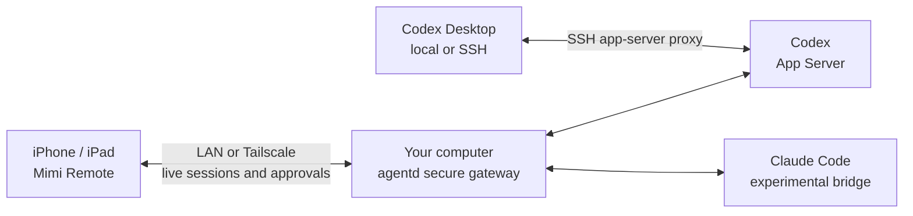

<p align="center">
  
</p>

<h1 align="center">Mimi Remote</h1>

<p align="center">
  <strong>Continue your computer's agent sessions on iPhone or iPad.</strong>
</p>

<p align="center">
  An open-source, native mobile workspace for Codex and Claude Code.<br />
  Connect directly to your computer and pick up sessions across devices without rebuilding context—follow work live, continue conversations, and handle approvals.
</p>

<p align="center">
  <a href="README.zh-CN.md">中文文档</a>
  &nbsp;·&nbsp;
  <a href="ios/MimiRemote/README.md">iOS build guide</a>
  &nbsp;·&nbsp;
  <a href="docs/project-status.md">Project status (Chinese)</a>
</p>
<p align="center">
    <a href="https://testflight.apple.com/join/jhGPbSk6"></a>
</p>

<p align="center">
  <a href="ios/MimiRemote/README.md"></a>
  <a href="ios/MimiRemote"></a>
  <a href="https://github.com/gaixianggeng/mimi-remote/actions/workflows/go-ci.yml"></a>
  <a href="LICENSE"></a>
</p>

<p align="center">
  
</p>

<p align="center">
  <sub>Continue computer sessions on mobile, control multiple devices, and pick up Codex or Claude Code without starting over.</sub>
</p>

Mimi Remote connects directly to your macOS, Windows, or Linux computer through Tailscale or the same local network. The project does not operate a relay, account system, or hosted session service. Your computer remains the control plane; data you intentionally send to Codex, Claude Code, GitHub, voice transcription, or MCP is still handled by those services under their own terms.

Mimi Remote is an independent third-party project. It is not affiliated with, endorsed by, or a product of OpenAI, Anthropic, or Tailscale. Codex is the primary supported runtime; the optional Claude Code bridge is experimental.

> Install the public release from the [App Store](https://apps.apple.com/us/app/mimi-remote/id6778076511) where available. [TestFlight](https://testflight.apple.com/join/jhGPbSk6) remains available for beta builds, and developers can build from source.

<p align="center">
  
  &nbsp;&nbsp;&nbsp;
  
</p>

<p align="center">
  <sub><strong>iPhone</strong> · same capabilities in one column: continue sessions, follow progress, handle approvals, control tasks.<br />
  <strong>iPad</strong> · the same sessions and controls opened into a multi-column workspace with more context.</sub>
</p>

Both devices share the complete session, approval, and task-control surface; only the layout, information density, and input ergonomics change. The native SwiftUI interface tunes compact navigation, wide-screen columns, touch feedback, and transitions for each device. With Reduce Motion enabled, movement falls back to restrained fades or static feedback. These images reuse the current [`web/assets`](web/assets) capture set and come from Debug-only seeded UI with demo hosts, projects, sessions, paths, and usage values—never a maintainer's live workspace or credentials. The interface uses the Simplified Chinese localization; the app also supports English.

## Carry the session from your computer to mobile

The common need is rarely “open a terminal on a phone.” It is to leave your computer and keep the same agent session moving without explaining the context again.

- **Continue:** pick up existing sessions across your computer, iPhone, and iPad instead of starting over when you leave the desk.
- **Follow live:** see whether a task is thinking, waiting, failed, or complete while structured replies and execution progress arrive.
- **Stay in control:** add context, queue the next instruction, change model or reasoning, answer a prompt, approve an action, or interrupt the turn.

When you need to finish deeper development work, advanced tools can inspect diffs, manage Worktrees, stage a file or hunk, commit, push, and open a draft pull request. None of those tools is required to use Mimi Remote.

## More than a pocket terminal

- Mimi Remote groups Codex and Claude Code messages, reasoning, commands, tool calls, approvals, and work into a readable timeline.
- New Codex sessions receive a concise model-generated title from the host computer; title generation is asynchronous and never blocks the conversation.
- Model, reasoning level, Skill, speed, permission mode, and queued turns stay next to the composer.
- Markdown, images, file references, voice input, and safe Quick Look reads work as mobile-native content.
- Spacing, hierarchy, touch feedback, and transitions are tuned separately for iPhone and iPad; Reduce Motion keeps the same state changes clear without spatial effects.
- Multiple host profiles keep separate tokens in Keychain; one active connection keeps the mental model simple.
- Readiness checks, reconnection, diagnostics, and bounded log export help recover without returning to the desk.

## Designed around context, not screen size

Mimi Remote keeps the same project and session model across devices, but each surface follows the way that device is actually used. iPhone keeps one-handed navigation compact, iPad opens the same capabilities into a context-preserving multi-column workbench, and the host computer continues running the agents. The device changes the presentation, not the available capabilities.

<p align="center">
  
  &nbsp;&nbsp;&nbsp;
  
</p>

<p align="center">
  <sub><strong>Appearance is first-class</strong> · light or dark mode, workspace icon sets, and editor-inspired themes.<br />
  <strong>Usage and host state stay visible</strong> · token windows, connected hosts, language, model, and permissions share one home.</sub>
</p>

<p align="center">
  
</p>

<p align="center">
  <sub>The 340-point Mac menu keeps host health, Codex and Claude runtime state, quota rings, pairing, diagnostics, and recovery actions one click away.</sub>
</p>

The hierarchy is intentional:

- **Preserve context:** iPhone keeps the current task close in a compact hierarchy; the iPad sidebar keeps projects and sessions visible while the detail area changes. Layout changes without removing session capability.
- **Disclose complexity progressively:** common status and actions stay close to the task, while setup, pairing, diagnostics, and deeper preferences move into focused surfaces.
- **Show state before action:** connection health, runtime readiness, remaining quota, and permission mode are visible before controls that can change or interrupt work.
- **Use each platform natively:** compact touch hierarchy on iPhone, multi-column workbench on iPad, and a dense menu bar utility on Mac — not one layout stretched across three screens.

The mobile images above are the same current assets used by the Mimi Remote website and come exclusively from Debug-only seeded UI. The Mac menu image uses the same source tree and the public `mimi-demo.local` hostname; capturing it did not restart or replace the installed Mac service. None of these public screenshots contains a real token, private address, personal path, or live project content.

## Architecture



This repository ships the complete link: the native iPhone/iPad app, the Go `agentd` gateway for macOS, Windows, and Linux, the Mac menu bar app, the Windows and Linux tray apps, and the Claude Code compatibility bridge. The mobile app connects only to your own host computer, so project files, session history, and runtime credentials stay on that computer.

- **Direct and responsive:** private-network REST and WebSocket connections carry live output, follow-up messages, task controls, and approvals without a Mimi-operated application relay.
- **Platform-specific Codex transport:** Linux and local terminal clients share one resident App Server through Codex's standard Unix control socket. macOS reaches the same socket through SSH, while Windows lets `agentd` own a loopback-only WebSocket App Server. None of these paths uses Desktop private IPC.
- **Two runtimes, one mobile experience:** Codex is the primary runtime, while the optional Claude Code bridge adapts its sessions and approvals to the same structured interface.
- **A small, explicit trust boundary:** `agentd` handles authentication, workspace authorization, and runtime routing on the host computer. That computer must remain awake and privately reachable.

For protocol details and exact capability boundaries, see [project status](docs/project-status.md) and the [Claude bridge architecture](docs/claude-bridge-architecture.md).

## Prerequisites

Check these before you install:

- **Required:** an iPhone or iPad running iOS/iPadOS 18 or later, a macOS, Windows, or Linux computer that can keep the host service running, and Codex CLI 0.149.1 or later installed and ready on that computer. Complete the runtime's own authentication on the host; Mimi Remote connects only to the `agentd` gateway and does not receive or manage runtime credentials or billing. See the [official Codex authentication guide](https://learn.chatgpt.com/docs/auth). iOS 26+ keeps the full Liquid Glass and on-device Apple Speech experience; iOS 18–25 uses simpler system materials and Codex voice transcription.
- **Network:** devices on the same trusted LAN can connect directly; Tailscale is not required. Across networks, use the same Tailnet or a secure HTTPS endpoint you administer. Never expose `agentd`'s plain HTTP endpoint directly to the public Internet.
- **Optional runtime:** Claude Code is experimental, disabled by default, and cannot replace Codex. If you enable it, install and authenticate Claude Code separately using an option in the [official Claude Code setup guide](https://docs.anthropic.com/en/docs/claude-code/getting-started); Codex CLI remains required.
- **iOS installation today:** install the public release from the [App Store](https://apps.apple.com/us/app/mimi-remote/id6778076511) where available. Use [TestFlight](https://testflight.apple.com/join/jhGPbSk6) for beta builds, or build from source with a Mac, Xcode 26 or later with the iOS 26 SDK, and XcodeGen; see the [iOS build guide](ios/MimiRemote/README.md).
- **Developer-only tools:** the normal packaged host install does not require Go or Rust. Those tools are only needed for backend or bridge source development. See the [full install, upgrade, and rollback guide](docs/install-upgrade-rollback.md) for platform details and current package availability.

## Install and run

### First installation in four steps

1. **Prepare Codex:** install Codex CLI, complete its own authentication on the host, and confirm the runtime is ready. Mimi Remote does not configure provider credentials or billing.
2. **Install and start the host:** follow the [platform installation guide](docs/install-upgrade-rollback.md), finish first-run setup, and confirm the service is ready.
3. **Install the iOS app:** download Mimi Remote from the [App Store](https://apps.apple.com/us/app/mimi-remote/id6778076511) where available, or join the [Mimi Remote TestFlight](https://testflight.apple.com/join/jhGPbSk6) for beta builds. Developers can instead follow the [iOS build guide](ios/MimiRemote/README.md) to run it from source.
4. **Pair:** open the host's pairing action (or run `agentd pair --qr-only`) and scan the short-lived QR code in Mimi Remote.

### Windows host

Windows 10/11 x64 is supported as an `agentd` host. Install and sign in to Codex CLI 0.149.1 or later as the same Windows user, then download the versioned `Mimi-Remote-Setup-*.exe`, `.sha256`, and `.metadata.json` files from [GitHub Releases](https://github.com/gaixianggeng/mimi-remote/releases/latest). Verify the SHA-256 before running the installer. An `unsigned-release` package is expected to report `NotSigned` and can trigger Microsoft Defender SmartScreen.

The per-user installer registers a limited Task Scheduler task and preserves configuration under `%APPDATA%\mimi-remote` during upgrades. `agentd` owns one Codex App Server at `ws://127.0.0.1:4222`, waits for a real protocol initialization, and stops the complete child process tree with the service. This loopback transport stays on the Windows host and does not use Desktop private IPC.

Private-LAN access is opt-in. Setup only enables it on a Private Windows network profile and limits the firewall rule to `LocalSubnet`; otherwise the host remains loopback-only unless Tailscale is available. See the [full install, upgrade, and rollback guide](docs/install-upgrade-rollback.md) for verification and recovery commands.

### Linux host

The Linux release includes a desktop tray with host status, Tailcat/Tailscale/LAN pairing, diagnostics, logs, and service controls. It uses theme-aware symbolic icons and StatusNotifierItem on compatible desktops; QR codes and confirmations open in your terminal. See [Linux desktop tray](docs/linux-tray.md) for desktop requirements and recovery steps.

Linux uses the release archive and a per-user systemd service. Install and sign in to Codex CLI 0.149.1 or later as the same Linux user, verify the release checksums, extract the archive, and run `bash ./scripts/install-linux.sh install`.

By default, Linux does not require `sshd`, an SSH key, or changes to `authorized_keys`. `agentd` attaches to `~/.codex/app-server-control/app-server-control.sock`; if it is absent, setup starts one resident Codex App Server in an independent user-systemd scope. A local terminal client launched with `codex --remote unix://` and Mimi can therefore open the same Thread through the same backend, and restarting `agentd` does not stop that backend. An explicit `AGENTD_APP_SERVER_SSH_TARGET` remains available for advanced remote-host deployments.

### macOS host

Requirements:

- A Mac running macOS 15 or later, with Codex CLI installed and signed in.
- The Mac and iPhone/iPad connected to the same private network. Tailscale is recommended for access across different networks but is optional for same-LAN use.

For the normal setup path, download [`Mimi-Remote-Mac.dmg`](https://github.com/gaixianggeng/mimi-remote/releases/latest/download/Mimi-Remote-Mac.dmg) and its SHA-256 file, verify the checksum, open the DMG, drag **Mimi Remote Mac** to Applications, then finish first-run setup from the menu bar. The app includes `agentd` and the compatible Claude bridge; Homebrew, Go, Rust, and Xcode are not required for the Mac host.

For command-line installation, server use, or recovery:

```bash
brew update
brew install gaixianggeng/tap/mimi-remote

codex --version
codex app-server --help
agentd up
```

Before the first start, enable Remote Login and make sure `ssh 127.0.0.1 true` succeeds without a password prompt. `agentd` supplies common Homebrew, npm, and mise paths when it checks Codex through a non-interactive SSH session; `agentd doctor` reports any remaining runtime-path problem. `agentd up` creates private local configuration, connects through localhost SSH to the shared Unix App Server, waits for a real protocol initialization, and prints a short-lived pairing QR code. It prefers Tailscale when available; otherwise it enables same-LAN access and publishes the current private LAN address. See [Shared SSH App Server](docs/shared-ssh-app-server.md) for Desktop setup and runtime boundaries.

Useful commands:

```bash
agentd status
agentd pair
agentd doctor --fix
agentd logs -n 200
agentd up --no-pair
agentd restart
agentd restart --no-pair
agentd stop
```

On macOS, `agentd restart` uses one atomic launchd kickstart, so it is safe to trigger from a remote task hosted by the current service. Do not run `brew services restart mimi-remote` directly from such a task.
From an agent, automation, or retained remote log, use `agentd up --no-pair` / `agentd restart --no-pair` so the output contains no pairing QR code, endpoint, or long-lived access token. `agentd up --no-pair --json` returns only the version, readiness state, and safe warnings rather than the complete setup result. When pairing is needed, have the user run `agentd pair --qr-only` in a local terminal.

For macOS, Windows, and Linux upgrade/recovery steps, see [Install, upgrade, and rollback (Chinese)](docs/install-upgrade-rollback.md). Maintainers can find the daily Internal TestFlight and formal host release flow in [Nightly and release (Chinese)](docs/nightly-release.md).

To let Codex perform the same install, upgrade, diagnosis, and rollback workflow with the repository's safety constraints, install the standalone Skill from:

```text
https://github.com/gaixianggeng/mimi-remote/tree/main/packaging/skill/install-mimi-remote
```

Ask `$skill-installer` to install that GitHub path. Each GitHub Release also includes `install-mimi-remote.zip` and its SHA-256 file for an auditable, versioned copy.

### Install the iOS app

The current source tree supports iOS/iPadOS 18 or later; App Store availability and minimum OS requirements follow the current listing for each region. Install the public release from the [App Store](https://apps.apple.com/us/app/mimi-remote/id6778076511) where available, or join the [Mimi Remote TestFlight](https://testflight.apple.com/join/jhGPbSk6) for beta builds. iOS 26+ gets the full advanced visual and on-device speech experience; earlier supported systems use deliberate fallbacks for unsupported capabilities.

To build the app from source instead, use a Mac with Xcode 26 or later and install XcodeGen before generating the Xcode project:

```bash
brew install xcodegen

xcodegen generate \
  --spec ios/MimiRemote/project.yml \
  --project ios/MimiRemote

open ios/MimiRemote/MimiRemote.xcodeproj
```

In Xcode, select the `MimiRemote` scheme, your development team, and an iPhone or iPad target, then Run. Xcode's Run button always follows the destination selected in its own toolbar and is not part of the command-line automatic selector, so verify that target explicitly. On first launch, scan the QR code printed by `agentd up` or `agentd pair`. The signed QR ticket can be reused during its 10-minute lifetime and never contains the long-lived token. Manual connection is available as a fallback.

Command-line daily builds and deployments have one entry point: `bash ./scripts/ios-dev.sh build|run`. It deterministically leases an available, paired USB iOS device first, then a currently reachable local-network device. The fixed `iPad Pro 13-inch (M5)` Simulator is used only when no reachable physical device is detected; if physical devices are present but busy, the command fails instead of silently switching device classes. Explicit `IOS_DEVICE_ID` and `IOS_DEVICE_NAME` selections support either physical-device transport and fail clearly when that device is not reachable. Tests, snapshots, and CI still require the exact M5 Simulator and never fall back to iPad mini. XcodeBuildMCP stores no device or Simulator target in repository defaults; its Simulator workflow is reserved for those fixed-Simulator tasks. Run `bash ./scripts/ios-dev.sh target` and `bash ./scripts/ios-dev.sh leases` to inspect the decision and current occupancy:

```bash
bash ./scripts/ios-dev.sh build-for-testing
```

### Build the backend from source (optional)

```bash
go test ./...
go vet ./...

# Foreground development; does not replace the Homebrew service.
go build -trimpath -o bin/agentd ./cmd/agentd
./bin/agentd setup --scan-root "$HOME/code" --browse-root "$HOME"
./bin/agentd serve
```

For repeated macOS testing against the installed Homebrew service, use the signed handoff pipeline instead of copying an ad-hoc Go binary into the Cellar:

```bash
bash ./scripts/restart-agentd-dev-macos.sh

# When triggered from a remote Mimi task:
bash ./scripts/restart-agentd-dev-macos.sh --no-wait
bash ./scripts/restart-agentd-dev-macos.sh --status
```

It signs each development build with a stable Apple Development identity, hands the replacement to an independent launchd job, verifies readiness, and rolls back automatically. At the beginning of every service start, agentd asynchronously probes configured project, scan, and browse roots; a browse root covering the current Home also probes Desktop, Documents, and Downloads so macOS Files & Folders prompts appear before the first real task. The probe never recursively reads files and never blocks the remote control plane while waiting for a click.

macOS does not provide one background-requestable permission for the entire user Home: Desktop, Documents, and Downloads are separate protected locations, while unattended access to other apps' data requires Full Disk Access. For that use case, add `/opt/homebrew/opt/mimi-remote/bin/agentd` once under System Settings → Privacy & Security → Full Disk Access. The first migration from an old ad-hoc build can still require one final approval.

## Claude Code bridge (experimental)

The Claude runtime is disabled by default. When enabled, `agentd` supervises one resident `alleycat-claude-bridge` and attaches mobile WebSocket sessions to it by a stable session key. Each Claude thread owns a headless stdio JSONL process; reconnects replay missed events or reload authoritative history instead of resubmitting `turn/start`.

The notarized Mac DMG already includes a compatible bridge next to `agentd`; do not install a second copy with Cargo for that setup. Install the bridge from source only for Homebrew, Linux, or standalone development:

```bash
cargo install --git https://github.com/gaixianggeng/mimi-remote.git \
  --locked --force --bin alleycat-claude-bridge alleycat-claude-bridge

command -v alleycat-claude-bridge
```

Enable it explicitly in the user configuration:

```json
{
  "claude": {
    "enabled": true,
    "bridge_bin": "",
    "args": [],
    "max_concurrent_bridges": 3,
    "env": { "TERM": "xterm-256color" }
  }
}
```

An empty `bridge_bin` selects the bridge bundled with Mimi Remote Mac. Homebrew and Linux installations must instead set the absolute path returned by `command -v alleycat-claude-bridge`. The configuration file contains long-lived credentials: back it up privately, update only the `claude` fields with a JSON-aware tool, preserve mode `0600`, and never print the complete file into logs or chats.

After changing the configuration, restart from the current service owner: use **Restart Service** in the Mimi Remote Mac menu, `agentd restart --no-pair` for Homebrew, or the user-systemd service on Linux. Run Doctor and confirm that the mobile runtime picker exposes Claude without disrupting Codex.

This remains an experimental channel. Goal, archive, and fork are not available for Claude sessions; there is no APNs background push or cloud synchronization. A bounded replay ring covers normal disconnects, while bridge/Mac restarts fall back to local Claude history and can still lose a very small unflushed window. Read the [Claude bridge architecture (Chinese)](docs/claude-bridge-architecture.md) before enabling it.

## Current limitations

- Mimi Remote is not a general-purpose SSH terminal and does not run Codex inside the iOS sandbox.
- Shared Codex sessions must be opened from a Desktop SSH host. Desktop's ordinary “This Mac” mode has private capabilities that are not injected into the shared App Server.
- It has no cloud account, code-hosting proxy, public relay, arbitrary remote shell, unattended deletion, or multi-user sharing.
- One iOS WebSocket can attach to a session at a time. Cloud/projectless threads, profile sync, and IDE sync are not implemented.
- Lock Screen approval reminders are an opt-in experiment that relies on a small maintainer-operated push service. They are off by default, and only command and file-change approvals can be answered without opening the app.
- A private Tailscale address is recommended across networks. Without Tailscale, Mimi Remote can use a private LAN address only while both devices are on the same local network. Do not expose `agentd` directly to the public Internet.
- Claude Code support depends on external CLI and bridge behavior, has a smaller feature surface, and must not be treated as the default runtime.

For the complete, code-oriented capability matrix and risk list, see [project status (Chinese)](docs/project-status.md).

## Privacy and security

Mimi Remote has no ads, analytics SDK, or maintainer-operated telemetry service. Project content, conversations, logs, code, and Codex/Claude credentials remain on your devices unless you explicitly use a third-party service such as Codex, Claude Code, GitHub, Codex voice transcription, or MCP. Apple voice input uses on-device SpeechAnalyzer processing.

Lock Screen approval reminders are the one optional exception, and they are off by default. Turning them on registers this install with a small maintainer-operated service so Apple can deliver a reminder while the app is suspended. That service receives only the APNs device token, anonymous short tags for the Mac and session, the approval kind, and an expiry — never prompts, commands, file contents, session history, or your `agentd` token. Your allow and deny actions still go straight to your own Mac. See the [architecture note](docs/secure-approval-push-architecture.md) and the [operations runbook](docs/operations/push-provider-ops.zh-CN.md).

The app rejects public HTTP endpoints at the application layer and is designed for Tailscale or same-LAN private-network use. Do not put real tokens, Tailnet IPs, private paths, logs, or project content in public issues, pull requests, or screenshots. Report vulnerabilities privately using [SECURITY.md](SECURITY.md). See the bilingual [privacy policy](docs/privacy-policy.md), [terms of use](docs/terms-of-use.md), [trademark and brand policy](TRADEMARKS.md), and [support page](docs/support.md).

## Development checks

Preview the checks selected from committed, staged, unstaged, and untracked changes, then run the quick tier once before pushing:

```bash
bash ./scripts/verify-change.sh --plan
bash ./scripts/verify-change.sh
```

The quick tier skips language builds for documentation and control-plane-only changes, tests only directly affected stacks, and defers broad regression to PR Gate. Use the full tier for cross-module, protocol, release, or other explicitly high-risk changes:

```bash
bash ./scripts/verify-change.sh --full
```

Physical-device validation is reserved for camera, notifications, Keychain, Tailscale/poor-network behavior, performance, and release checks. See [CONTRIBUTING.md](CONTRIBUTING.md) for the tier rules and targeted troubleshooting commands.

Formal release validation remains a separate step from these change tiers:

```bash
bash ./scripts/verify-release.sh
```

## Repository layout

```text
ios/MimiRemote/          SwiftUI iPhone / iPad app
cmd/agentd/ + internal/  Go safety gateway and Codex / Claude control plane
bridges/claude/          Rust Claude Code protocol bridge
```

`gaixianggeng/mimi-remote` is the single canonical source and release repository for the iOS app, Mac app, Go backend, Claude bridge, tests, documentation, and release tooling. The one-time transition from the former complete-source repository and the conflicting historical archive is documented in the [Chinese repository-rename runbook](docs/operations/github-repository-rename-runbook.zh-CN.md); historical v0.1.0–v0.2.2 assets are backed up offline instead of maintaining a second live mirror.

## Contributing

Open a [GitHub issue](https://github.com/gaixianggeng/mimi-remote/issues/new) with a reproducible problem or proposal. Read [CONTRIBUTING.md](CONTRIBUTING.md) before submitting code. Links to Chinese technical docs above are labeled explicitly; English contributions are welcome.

## License

Mimi Remote's iOS app, Mac app, Go backend, and documentation are licensed under [GNU GPLv3](LICENSE) with an additional App Store / Google Play distribution permission under GPLv3 section 7. Commercial use and paid distribution are allowed. If you distribute a GPL-covered modified work or object code to another party, however, you must ensure recipients receive the GPLv3 rights for that covered work and provide Corresponding Source or a GPLv3-compliant way to obtain it. You may not distribute that covered work as a closed-source product that withholds those rights or the required access to Corresponding Source; independent works and third-party components remain governed by their own licenses.

GPLv3 grants rights in code, not additional rights to the Mimi Remote name, logo, app icon, or official-distribution identity. A user-facing modified product that uses those Project Marks must follow the [Trademark and Brand Policy](TRADEMARKS.md); without written permission, it must use independent branding and must not present itself as an official release. Truthful “based on Mimi Remote” and compatibility statements remain permitted.

[`bridges/claude`](bridges/claude) is derived from Alleycat contributors and remains [GPLv3-only](bridges/claude/LICENSE); the root store-distribution exception does not apply to that upstream code. Third-party notices are in [NOTICE.md](NOTICE.md) and [THIRD_PARTY_NOTICES.md](THIRD_PARTY_NOTICES.md).

Historical versions previously and explicitly released under the MIT License remain governed by that original license; this change does not retroactively revoke rights already granted.
