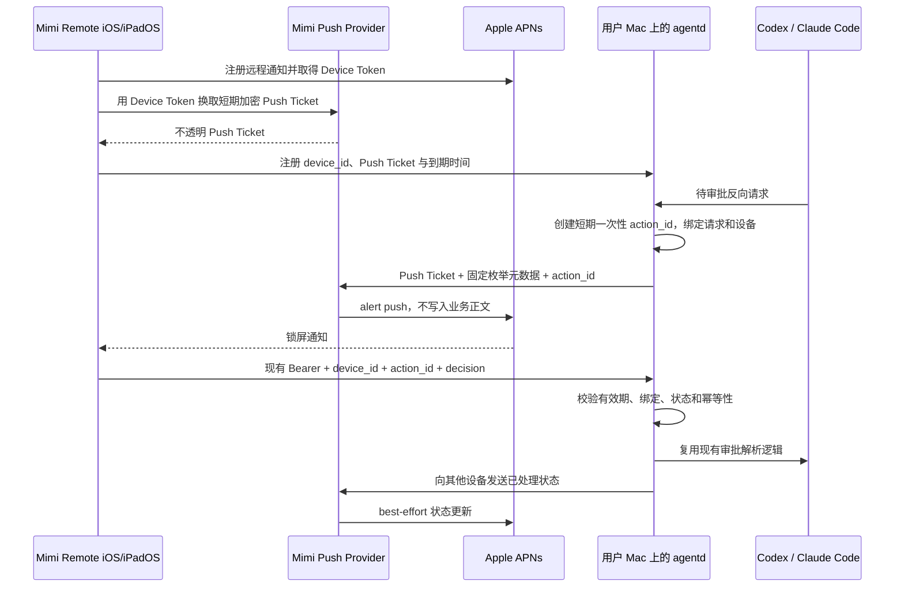

# 锁屏审批通知最小架构

更新日期：2026-09-10
状态：四个阶段主体代码已完成。历史部署和 iPad 局部真机闭环见下文；当前正在按 #353 收尾。
最新部署要求：与 Tailcat DERP 共用服务器，独立进程和密钥权限。已确认同机部署；最新代码的完整真机验收尚待完成。

已确认的两条产品决策：

1. 接受由维护者运营一个只转发固定格式任务消息的最小 APNs Provider。
2. 消息提醒是**默认关闭的实验性功能**。只有用户在 App 内显式同意使用该中转服务后才注册 Device Token 并发送提醒；坚持纯本地部署的用户不开启即可，链路上不产生任何对外请求。

## 目标

让 Mimi Remote 在 iPhone 或 iPad 锁屏、App 位于后台或进程未运行时，仍能收到 Codex / Claude Code 待审批提醒，并从系统通知完成单次允许、拒绝或进入详情。

消息覆盖审批、需要补充信息、AI 回复完成、任务失败和中断，不增加云账号、会话托管、代码中继、模型代理或通用消息推送。现有前台 WebSocket 与私有网络审批链路必须在 APNs 故障时继续工作。

## 消息提醒扩展（2026-09-08）

- 设置统一为“消息提醒”。审批和补充输入沿用原流程；新增 `turn.completed`、`turn.failed` 和 `turn.interrupted`，流式文字与工具进度不触发消息提醒。
- 网关只在入站线程鉴权通过后处理终态。正在自动重试的错误不推送，也不释放后台观察连接。活跃后台任务最多保留 24 小时，连接数量仍受原上限约束，空闲时回收。
- 每个 runtime/thread/turn 只投递一次终态；后台不缓存回复正文。Provider 仅收到固定枚举、匿名编号和有效期。
- 回复和失败通知只有查看详情，不能获得审批权限。点击后通过原私有连接获取本机路由，并打开来源 Mac 和任务。App 正在展示该任务时不播放声音或横幅。
- 通知定位记录落盘在设备注册表旁（`push-routes.json`，权限 0600），只含 runtime、线程 id、作用域 id、工作目录、设备集与到期时间，不含正文、标题或 Token；最多 256 条、按原始推送时刻保留 24 小时，Mac 服务重启既不清空也不延长有效期，重启前已推送的 turn 不会再推一次。定位记录不赋予任何审批权限：审批句柄仍只在内存、重启即作废，已在另一台设备处理完的审批照样能定位到会话，只是 `state` 说明它不可再操作。点开通知时 agentd 按当前作用域配置重新推导该线程的授权，路径已不在项目、browse root 或 worktree 之内则不补种。失效通知不执行任何操作，用户仍可在任务列表查看历史。此版本不是持久化消息收件箱。
- 锁屏显示会话标题（2026-09-10，#418）：`turn.*` 消息与审批一样带 `aps.mutable-content: 1`，允许设备上的 Notification Service Extension（`com.gaixianggeng.mimi.notificationservice`）在展示前改写标题、副标题和正文。标题与项目名只来自 App 写在 App Group 里的本地缓存，键是会话匿名标签（即 `aps.thread-id`）；Provider 与 APNs 收到的仍然只有本地化 key 和匿名标签，从不接触标题。缓存未命中或旧版 App 没有该扩展时，照常显示通用文案。

## 方案

### 已确认的产品边界

APNs 要求 Provider 通过 Apple 签发的私钥或证书向 APNs 发起请求。该凭据属于 Mimi Remote 的开发者团队，不能放进 iOS App、`agentd`、公开仓库或 Release 资产。因此：

- 要满足“App 已挂起或未运行时收到锁屏通知”，必须存在维护者可控、持有 APNs Provider 凭据的公网服务。
- 让每个用户自行部署 Provider 只有在用户自行更换 Bundle ID、签名并持有自己的 Apple Developer 凭据时才成立，不适合作为 App Store 版本的日常路径。
- 如果继续坚持“维护者不运营任何中转服务”，本 Issue 只能保留当前 App 在线时的本地通知，无法满足远程锁屏通知验收标准。

结论：接受一个只转发固定格式审批提醒的最小 Provider。它不接收提示词、代码、完整命令、文件内容、会话历史或 `agentd` 访问 Token；审批动作仍由设备通过现有私有网络直接提交给用户自己的 `agentd`。

### 用户同意与功能开关

中转服务是可选项，不是默认链路。约束如下：

- 功能位于 App 的高级 / 实验功能区，默认关闭。关闭状态下 App 不请求远程通知授权、不注册 Device Token、不向 Provider 发送任何请求。
- 首次开启必须展示明确的同意说明：会离开设备的是什么（APNs Device Token、匿名主机与会话标签、审批类型枚举、到期时间）、不会离开设备的是什么（Prompt、源码、完整命令、文件内容、会话历史、`agentd` 访问 Token）、以及数据保留策略。未同意即不开启。
- 关闭开关等价于撤销：App 注销 Device Token，`agentd` 删除本地 Ticket 并请求 Provider 把 Ticket ID 加入撤销表。
- `agentd` 侧同样默认关闭（`push.enabled`）。Provider 未配置或用户未同意时，代码路径必须与今天完全一致，升级不产生任何静默上传。
- 纯本地部署因此仍然成立：不开启该实验功能的用户，其审批链路依旧只经过自己的私有网络。

### 现状基础与第二个前置条件

仓库已经具备一部分可复用能力：

- iOS 在收到 `.approvalRequest` / `.userInputRequest` 后会安排本地通知，通知路由只含 profile、project 与 session 标识；现有 Bearer Token 使用 `kSecAttrAccessibleAfterFirstUnlockThisDeviceOnly` 保存在 Keychain。
- raw Codex gateway 已维护反向请求 allowlist、同 ID 响应、权限响应安全重写、一次消费和过期清理。
- Claude resident bridge 已支持断线后的 `serverRequest/replay` 与 resolved 清理。

但生产环境的 raw Codex 路径仍是 iOS WebSocket 与上游 app-server WebSocket 一对一代理。App 进入后台时会主动退役 WebSocket，`agentd` 随之失去接收后续反向审批请求的连接。仓库中旧的 `CodexAppServerRuntime` 内存审批 broker 没有注入生产 Router，不能误当成现成后台链路。

因此只增加 APNs 调用仍然不够。实现必须先让 `agentd` 在活跃 turn 期间拥有一个有界的 Codex approval broker：iOS 断开后继续读取原上游连接，只保留待审批反向请求、必要 resolution tombstone 和有界恢复元数据；iOS 重连时恢复同一连接或走权威历史对账，并重放仍有效的 server request。它不持久化 Prompt、输出或完整会话，`agentd` 重启后继续 fail closed。Claude 路径复用现有 resident bridge，不复制第二套完整 runtime。

### 数据流



### 组件职责

| 组件 | 负责 | 不负责 |
| --- | --- | --- |
| Mimi Remote | 通知授权、Device Token 刷新、动作类别、系统解锁保护、直接调用 `agentd`、通知清理 | 不持有 APNs Provider 私钥，不在 Payload 中放长期凭据 |
| `agentd` | 多设备映射、审批事件识别、一次性动作状态机、幂等校验、调用 Provider、继续提供前台审批 | 不把会话、源码或完整命令上传到 Provider |
| Mimi Push Provider | 校验固定请求、解密 Push Ticket、生成 APNs 请求、最小观测、密钥轮换 | 不托管账号、会话、代码，不代理审批动作 |
| APNs | 系统级投递、通知分组与动作入口 | 不承诺固定投递延迟，不作为审批状态权威来源 |

### Push Ticket

Provider 不长期保存 APNs Device Token。iOS 把新 Token 提交给注册接口后，Provider 返回一个经过认证加密的不透明 Push Ticket，内部只包含：

- 协议版本、Ticket ID 与密钥版本；
- APNs 环境、Topic 和 Device Token；
- 随机设备安装标识的摘要；
- 签发时间与到期时间。

`agentd` 只保存 Ticket、`device_id`、到期时间和最近刷新时间，看不到其中的 APNs Token。Ticket 建议 30 天到期，App 每次前台启动时在剩余 7 天以内刷新。刷新或忘记连接时，`agentd` 删除旧 Ticket，并请求 Provider 将旧 Ticket ID 加入只保留到原到期日的撤销表。

Provider 的持久数据因此可以限制为“已撤销 Ticket ID + 到期时间”。遗失 Ticket 最多只能向绑定的单台设备发送固定格式的 Mimi 通知，不能访问 `agentd`，也不能直接批准请求；仍需按 Ticket 和来源限速。

### APNs Payload

Provider 只接受固定 Schema，不接受调用方传入任意标题、正文或 APNs 字典。建议字段如下：

```json
{
  "version": 1,
  "event": "approval.pending",
  "action_id": "128-bit-random-opaque-id",
  "device_id": "random-installation-id",
  "profile_id": "installation-derived-16-hex-tag",
  "host_tag": "A1C3",
  "session_tag": "7D92",
  "approval_kind": "command",
  "expires_at": "2026-08-09T06:15:00Z"
}
```

`profile_id` 是 `installationID` 经带域前缀的 SHA-256 摘要截断得到的 16 位十六进制标签。
它不是 Connection Profile 的原始 ID，也不包含主机名或账号信息。

Provider 根据枚举生成本地化 APNs Payload：

- `apns-push-type: alert`；
- `apns-topic` 固定为 Mimi Remote Bundle ID；
- `apns-expiration` 不晚于审批到期时间；
- `apns-collapse-id` 使用单个审批请求的稳定标识，避免重复投递产生多张卡片；
- `aps.category` 固定为审批类别；
- `aps.thread-id` 使用会话匿名标签，按会话归组；
- `aps.mutable-content` 固定为 `1`（审批与 `turn.*` 消息均带）：只授权设备上的通知扩展用本机缓存改写文案，Payload 不因此多带任何字段；
- 标题和正文使用 App 包内本地化 key，只显示匿名主机标签、会话标签和审批类型。

不得放入访问 Token、工作目录、项目名、源码、Prompt、完整命令、文件内容、Diff、模型输出、长期凭据或可反查用户身份的名称。

会话标题只在设备上出现：App 维护一份 App Group 本地缓存（会话匿名标签 → 会话标题 / 项目），通知扩展按 `aps.thread-id` 查表改写标题、副标题和正文；Provider 和 APNs 自始至终看不到标题，缓存缺失时保留通用文案。

### 通知动作

- “允许一次”：`UNNotificationAction` 使用 `authenticationRequired`，系统必须先解锁设备。
- “拒绝”：建议同时使用 `authenticationRequired` 与 `destructive`，避免未授权的人仅凭锁屏访问就中断任务。
- “查看详情”：使用通知默认点击进入 App 并路由到对应会话。

Apple 在通知界面空间有限时最多展示两个自定义动作，因此“查看详情”不应占用第三个自定义按钮；两个按钮用于允许和拒绝，点击通知本身完成查看详情。

动作回调只携带严格解析后的路由与 `action_id`。App 用现有 Keychain Bearer Token 直接调用目标 `agentd`，等待网络结果或短超时后再结束系统回调；网络不可达时不猜测结果，提示用户打开详情重试。

### 一次性动作状态机

`agentd` 为每个待审批请求生成至少 128 bit 随机 `action_id`，只在本机保存，并绑定：

- runtime、session ID、原始 approval ID；
- 允许响应的 `device_id` 集合；
- 签发与到期时间；
- `pending / executing / approved / rejected / expired / revoked` 状态；
- 已提交 decision 的幂等结果。

处理决策时必须原子完成校验和状态迁移：

- 首次合法决策进入 `executing`，然后复用现有运行时审批解析；
- 同设备、同 decision 重放返回已完成结果，不再次调用 runtime；
- 冲突 decision 返回 `409`；过期、撤销或会话结束返回 `410`；未知句柄返回 `404`；
- 前台已经处理、runtime 超时或会话结束时立即撤销所有相关 action ID；
- `agentd` 重启后不恢复旧审批动作，现有 runtime 请求继续 fail closed。

短期 `action_id` 本身不足以执行审批：请求还必须通过现有 Bearer 鉴权、目标私有网络可达性和设备绑定校验。

### 状态更新与通知清理

`agentd` 是审批状态的唯一权威来源。某台设备处理完成后：

1. 原子落定本地 action 状态并响应设备；
2. 向其余注册设备发送 `approval.resolved`；
3. iOS 收到动作结果或后台状态更新后删除对应 delivered notification；
4. App 下次前台恢复时重新读取待审批状态，清理所有已完成、撤销或过期通知。

远程清理是 best-effort；APNs 可能延迟或合并投递，因此旧通知仍可能短暂存在。任何旧通知再次操作时都由 `agentd` 返回已经处理或过期，不能二次生效。

## 实现

### 仓库改造边界

建议按一个 Issue 内的四个可单独测试阶段推进：

1. `agentd` approval broker：让 raw Codex 的活跃上游连接在 iOS 退到后台后有界存活，复用 gateway allowlist、response mapper、permissions 重写与 Claude replay 语义；不把旧 `CodexAppServerRuntime` 直接接回生产。
2. `agentd` 安全动作层：增加设备注册、动作句柄状态机、Provider client 与审批生命周期挂钩；默认关闭，Provider 未配置时完全不影响现有行为。
3. iOS / iPadOS：增加 Push Notifications capability、AppDelegate Device Token 回调、通知类别、后台动作处理和设置状态；复用现有通知路由与 Keychain Token。
4. Provider：新增最小 Go 服务和 Docker 部署，只有 Ticket 注册/刷新/撤销与固定审批通知接口；不与 `agentd` 共用 APNs 私钥。

主要插入点以当前生产路径为准：

- `internal/httpapi/appserver_gateway_threads.go`：反向请求登记、replay、resolved 与 terminal 清理；
- `internal/httpapi/appserver_gateway_policy.go`：同 ID response 与 permissions 安全重写；
- `internal/httpapi/appserver_gateway_websocket.go`：当前一对一代理生命周期，需要收敛为可短期 detach / reattach 的本机 broker；
- `ios/MimiRemote/Sources/State/SessionStoreConnection.swift`：现有审批本地通知投影；
- `ios/MimiRemote/Sources/MimiRemoteApp.swift`：通知 delegate、冷启动路由与后续 action 分流；
- `ios/MimiRemote/Sources/Core/API/CodexAppServerTransport.swift`：现有 Allow / Deny JSON-RPC response，可作为动作最终落点。

功能门禁建议使用 `capabilities.disabled` 与独立 `push.enabled` 配置双重控制。默认配置不开启 Provider，避免升级后无意上传 Device Token。

### Provider 部署与密钥

MVP 使用单个小型 Go 服务即可，前面放托管 TLS；撤销表可以使用单实例持久卷上的 SQLite。若需要多实例或无服务器部署，再换成托管 KV，不提前引入队列、Kafka 或完整账号数据库。

秘密只通过部署平台的 Secret Store 或主机权限为 `0600` 的外部文件注入：

- APNs `.p8` Provider key、Key ID、Team ID；
- 当前和上一版 Push Ticket 加密密钥；
- 必要的运维访问凭据。

轮换顺序为“创建并部署新 key → 观察成功投递 → 切换签发 → 等旧 Ticket 窗口结束 → 撤销旧 key”。APNs Provider Token 按 Apple 要求定期重建，进程内缓存时间不得超过其有效窗口。

### 观测与保留

Provider 只记录：请求计数、延迟、限速、APNs HTTP 状态/原因、匿名 Ticket ID 摘要和密钥版本。禁止记录 Authorization、Push Ticket、Device Token、`action_id`、完整请求体或 APNs Payload。

建议保留策略：

- 撤销 Ticket ID：仅保留到 Ticket 原到期日，最长 30 天；
- 无 Payload 的结构化错误日志：7 天；
- 聚合成功率与延迟指标：30 天；
- APNs Device Token：不落库，只在注册和投递请求的进程内短暂处理。

至少告警：APNs 认证失败、Topic/环境不匹配、`410 Unregistered` 激增、Provider 5xx、投递延迟和撤销表不可写。

### 成本

低量 MVP 的计算与存储需求很小：一个小型 Go 容器、TLS、少量 SQLite/KV 和指标即可。实际现金成本取决于是否复用现有 Linux 主机；主要长期成本不是 CPU，而是公网可用性、系统补丁、APNs 密钥轮换、告警和值守。若没有现有主机，托管容器加托管 KV 可降低运维，但会增加平台依赖。

### 故障降级

- Provider 或 APNs 不可用：记录有界错误，不阻塞 runtime；前台 WebSocket 审批保持可用。
- 通知权限拒绝：Device Token 可以注册，但不得声称锁屏提醒已启用；设置页展示恢复路径。
- Ticket 过期：停止远程推送并提示 App 前台刷新，不回退到不受控凭据。
- 通知动作网络超时：不自动重试 Allow；打开详情后从 `agentd` 读取权威状态。
- APNs 重复、延迟或乱序：由 collapse ID、一次性 action ID 和本地状态机吸收。

### 测试与验收

- Provider：固定 Schema、超长/未知字段、Ticket 篡改/过期/撤销、限速、APNs 错误映射和密钥轮换测试。
- `agentd`：多设备、并发相反决策、重复决策、过期、前台先处理、会话结束、runtime 超时和恶意重放测试。
- Codex broker：iOS detach 后收到审批、重连 replay、无重复上游 response、终态清理、有界容量与 broker TTL 测试；Claude replay 继续回归。
- iOS：授权状态、Token 刷新/注销、Payload 严格解码、动作类别、通知路由、网络超时、状态清理和权限拒绝测试。
- 集成：使用假 Provider / 假 APNs 验证端到端协议，不在 CI 使用真实 APNs 私钥。
- 运行态：实体 iPhone 与实体 iPad 分别验证 App 前台、后台、被系统终止、锁屏、设备重启后首次解锁、多设备竞争和 Tailscale 暂时不可达。Simulator 结果不计为通知专项验收。

## 实现进度

| 阶段 | 状态 | 说明 |
| --- | --- | --- |
| 一：`agentd` approval broker | 已完成 | Codex gateway 的上游连接升级为具名会话所有，客户端离线期间继续接住审批请求；Claude 复用常驻 bridge，并新增只读观察连接补上「agentd 不再读 bridge」的缺口。由 `app_server.approval_broker` 控制，默认关闭。 |
| 二：`agentd` 安全动作层 | 已完成 | `internal/pushbridge`：设备注册表、一次性动作句柄状态机、Provider 客户端。由 `push.enabled` 控制，默认关闭；Provider 未配置时即使 enabled 也保持关闭。 |
| 三：iOS / iPadOS | 已完成 | 远程通知授权与 `aps-environment`、Device Token 生命周期、通知类别与两个需身份验证的动作、实验功能开关与绑定收件主机的同意、Payload 白名单解码、前台恢复后的通知对账。 |
| 四：最小 Provider | 已完成并部署 | `cmd/mimi-push-provider`。 |

### 锁屏可直接放行的范围

只有 `command` 与 `patch` 提供锁屏「允许 / 拒绝」按钮：它们的响应形状是无歧义的
`{"decision": ...}`，可以原样走 gateway 既有的客户端帧校验链路。

`permission`、`user_input`、`elicitation` 仍然发通知，但只提供「查看详情」：

- `permission` 的允许会授予一个作用域，拒绝必须以 JSON-RPC error 表达，盲批风险过高；
- `user_input` 与 `elicitation` 离开内容根本无法作答，而内容正是我们刻意不放进推送的东西。

### 决策如何回到 runtime

锁屏决策不会另起一条审批通路。`agentd` 把它合成为一条与 iOS 前台**完全同形**的
JSON-RPC response，再交给 gateway 既有的 `validateClientFrameContext`：外部 Desktop
守卫、同 ID 一次性消费、permissions 安全重写全部原样复用。这样不会出现「前台被
守卫拦住、锁屏却放行」的分叉。

### 已上线的部署

- 服务：`mimi-push-provider.service`（systemd，专用 `mimi-push` 用户，`ProtectSystem=strict`，仅 `/var/lib/mimi-push-provider` 可写）。
- 监听：`127.0.0.1:8087`，经 nginx `snippets/mimi_push_locations.conf` 以 `/mimi-push/` 前缀对外，`/mimi-push/metrics` 不对外。
- 密钥：`/etc/mimi-push-provider/`（`0750 root:mimi-push`），ticket 密钥与 APNs `.p8` 均为 `0640`，只在服务器上生成或放置，不进入仓库与 Release 资产。
- 撤销表：`/var/lib/mimi-push-provider/revocations.db`，每小时清理已自然到期的记录。

已验证：健康检查、Ticket 签发/撤销、非法枚举拒绝、限速、撤销后拒绝，以及 Codex 与
Claude 两条 runtime 的载荷经公网到达 APNs。真实 APNs Auth Key 已部署；用伪造的
Device Token 验证时 Apple 返回 `BadDeviceToken`，说明 Provider 鉴权已经通过。真机成功
投递仍按下文两条触发路径分别记录，不能用伪造 Token 的鉴权检查代替。

### iOS 侧的两条边界

**同意绑定到主机**。用户同意的是「把设备 Token 交给这个主机」，不是「开启一个功能」。
收件主机变化后必须重新征得同意，否则一次 agentd 配置改动就能把 Token 导向别处。

**环境判定以描述文件为准**。APNs 的 sandbox 与 production 使用两套互不相通的
Device Token，选错不会报错，只会让每一条推送静默失败。因此环境从嵌入的描述文件
读取，读不到才退回按构建配置判断。这里有个已经被测试抓到的坑：描述文件写的是
`development` / `production`，而 APNs 主机的措辞是 `sandbox` / `production`，
直接按 rawValue 解析会让 `development` 落空。

### 两条触发路径，只验证了其中一条

推送有两种触发时机，必须分开看：

| 路径 | 场景 | 状态 |
| --- | --- | --- |
| **A · 到达即推** | 用户已离开，审批之后才产生 | 代码与单测覆盖，**真机未触发过** |
| **B · 离开补推** | 审批在前台产生，用户随后带着它走开 | **真机验证通过** |

原实现只有 A。B 是真机验证时发现的缺口——审批「到达时用户在看」不等于「用户会
一直在看」，带着未应答的审批走开恰恰是本 Issue 要解决的核心场景，却完全没有提醒。

### 早期尚未验证的路径与疑点（2026-08-20）

三次真机尝试中，审批**每次都在客户端重连之后 7～8 秒才到达**（`attached=true`），
因此路径 A 一次都没被真正触发。turn 发起到审批到达最长间隔达 4 分钟，而其中
绝大部分时间客户端是离线的。

离线期间上游**并非静默**（可见 `thread/status/changed` 与 response 帧），所以不是
连接断了。嫌疑指向 `thread-handoff`：客户端断开前会请求交接，agentd 随后 archive
线程以释放 app-server 的 writer 锁。**如果 archive 会挂起正在跑的 turn，那么
「Agent 在用户离开时继续工作」这一前提不成立，路径 A 在现实中永远不会发生。**

这比推送本身更根本，需要单独确认。验证方法：让审批必然落在离线窗口内——先在
工作区跑一条不需要审批的耗时命令（如 `sleep 90`），再执行需要审批的操作，发出后
立刻锁屏并保持 2 分钟以上。

2026-09-08 按当前共享 SSH App Server 重新验证后，确认当前断点是任务订阅生命周期：
页面退订会移除 Mac 连接的 turn/item 事件；此外，broker 的启动保活只识别旧的
`turn/start`，没有识别目前使用的 `thread/queue/add`。旧实现的两条精确回归均失败。
当前修复由 Mac 保留运行、排队和待审批任务的订阅，终态后释放；通过提交的
`clientUserMessageId` 与 userMessage 的 `clientId` 确认本条消息已经开始，避免前一轮
结束时误删下一轮的保活。重新打开运行中的任务时读取 `thread/resume` 的 active 状态。
离开页面后的审批提醒不再依赖共享 WebSocket 已经断开。

真实 App Server 对照显示：旧版发送后退订，只继续收到状态变化，65 秒内没有回复终态；
保持订阅的对照任务正常完成。修复版通过普通队列发送后立即退订，在约 34 秒收到
`turn/completed`，真实设备 Ticket 的 APNs 请求返回 200。这证明服务端事件和推送请求
已贯通。发送后立即关闭客户端的独立测试也产生 APNs 200，用户已确认 iPad mini
显示通知。随后发现点击路由在请求完成前清空 SwiftUI task id，可能取消自身请求；
当前改为完成后消费通知，等待前台恢复并复用 Tailcat 路线。失效路由的 410 与未授权
设备的 403 使用确定提示，不再报电脑离线。点击打开、身份验证和审批操作仍需继续验收。

### 真机验证暴露的三个问题

这三个都是单元测试测不出来的，记下来避免重复踩。

**1. 复用上游连接 ≠ 复用握手状态。** broker 让一条 app-server 连接跨多次客户端
连接存活，但 JSON-RPC 握手是有状态的：客户端每次重连都会重发 `initialize`，
而那条上游早已握过手，回 `already initialized`，iOS 判定致命错误后断开重连，
形成每秒一轮的风暴。修法是 broker 缓存首次握手结果并在重连时本地应答，上游
只握手一次。设计复用型连接时，**先问哪些状态是「每个客户端会话一份」的**。

**2. nil receiver 安全救不了字段访问。** `relayGatewayConnMonitor` 的方法都做了
nil 保护，但 `sink.monitor` 这一步在 `sink` 为 nil 时就已经解引用，直接
SIGSEGV 打死整个 agentd。而「客户端离线、sink 为 nil」恰恰是 broker 存在的
意义，是最常见状态而非边角情况。

**3. 确定的失败不能报成「未知」。** agentd 用 404/409/410 表达「已过期」「冲突」
「已被处理」，iOS 的 API 客户端对非 2xx 一律抛错，被一个 catch 兜住后全变成
「结果未知」。这违反了本文档自己写的「UI 必须能表达已经由其他设备处理的状态」。

**这三个里有两个直接打断了主消息通道**——broker 改的是 gateway 的连接生命周期，
不是旁路。这也是 `app_server.approval_broker` 必须独立成开关并默认关闭的理由：
推送本身是纯附加的，broker 不是。

### 一处运维上的坑

APNs 的协议级拒绝必须以 `200 + delivered:false + reason` 回报，不能用 5xx：托管 CDN
会把 5xx 的响应体替换成自己的错误页，`reason` 就此丢失，线上只剩一个无从下手的
状态码。传输层故障仍然回 502 —— 那种情况本来也没有 reason 可言。

## 风险与优化

- 这是对当前“开发者不运营中转服务”隐私承诺的实质变化。上线前必须更新中英文隐私政策、App Store 隐私披露、README 和运维文档。
- Provider 即使不保存内容，也会处理 APNs Device Token、来源 IP 和匿名设备元数据；必须按真实部署校准披露与日志保留。
- `authenticationRequired` 保护的是系统解锁，不代替 `agentd` 的 Bearer、设备绑定和一次性状态校验。
- 通知动作后台执行时间和私有网络可达性受系统限制；设计必须把“未知结果”展示为未知，不能把超时当作成功或失败。
- APNs 不保证固定延迟，也不能保证远程状态更新立即移除已经展示的通知；恢复前台后的权威对账不可省略。
- 会话标题已改由设备上的 Notification Service Extension 从 App Group 本地缓存改写（#418），没有经由 Provider 传输任何标题，也没有引入设备公钥加密。命令摘要等更多内容仍不展示；若将来确实需要端到端可读的内容，须另行评估加密方案，而不是放宽 Provider 的固定枚举。

## 参考资料

- [Registering your app with APNs](https://developer.apple.com/documentation/usernotifications/registering-your-app-with-apns)
- [Setting up a remote notification server](https://developer.apple.com/documentation/usernotifications/setting-up-a-remote-notification-server)
- [Sending notification requests to APNs](https://developer.apple.com/documentation/usernotifications/sending-notification-requests-to-apns)
- [Generating a remote notification](https://developer.apple.com/documentation/usernotifications/generating-a-remote-notification)
- [Declaring your actionable notification types](https://developer.apple.com/documentation/usernotifications/declaring-your-actionable-notification-types)
- [`authenticationRequired`](https://developer.apple.com/documentation/usernotifications/unnotificationactionoptions/authenticationrequired)
